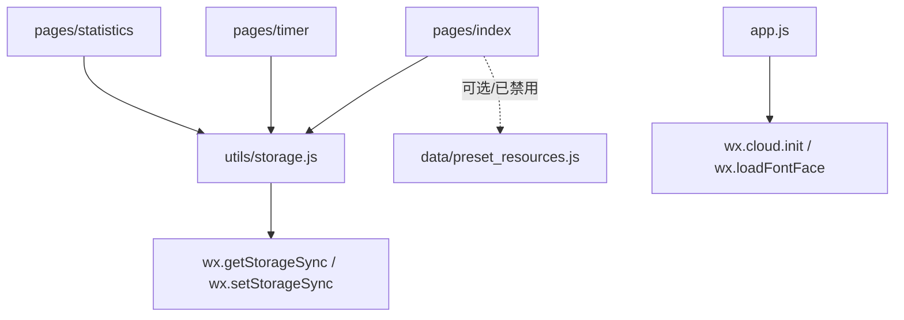

# Code Wiki：英语启蒙时间记录（微信小程序）

## 1. 项目概览

该仓库是一个微信小程序，用于记录孩子的英语启蒙学习时长，支持：

- 多“宝贝档案”（child）切换
- 为每个宝贝维护多个学习项目（project，例如绘本/儿歌/动画片等）
- 通过计时或手动录入生成学习记录（record）
- 统计页展示周趋势、月日历打卡、各项目累计时长

核心特点是“本地存储优先”：业务数据通过 `wx.getStorageSync / wx.setStorageSync` 存在用户设备本地，无需后端即可运行；代码中保留了云开发初始化以及云端资源导入的占位逻辑，但当前业务路径默认禁用导入。

## 2. 技术栈与运行形态

- 平台：微信小程序原生（`App()` / `Page()` / `wx.*` API）
- 语言/资源：
  - 逻辑：JavaScript
  - 视图：WXML
  - 样式：WXSS
  - 模板内格式化：WXS（仅用于展示层格式化时长）
- 数据：本地存储（见 `utils/storage.js`）
- 可选能力：云开发 `wx.cloud.init()`（见 `app.js`，不影响本地流程）

## 3. 目录结构

```
.
├─ app.js                      # 小程序入口（生命周期、云初始化、字体加载）
├─ app.json                    # 全局路由与窗口配置
├─ app.wxss                    # 全局样式与设计变量
├─ pages/
│  ├─ index/                   # 首页：宝贝管理 + 项目列表 + 手动录入
│  ├─ timer/                   # 计时页：计时 + 保存记录
│  └─ statistics/              # 统计页：周/月/累计
├─ utils/
│  └─ storage.js               # 本地存储数据层（children/projects/records）
├─ data/
│  ├─ preset_resources.js      # 预置资源（云端导入用，当前业务路径不可达）
│  └─ preset_resources.json
├─ project.config.json         # 微信开发者工具工程配置
├─ project.private.config.json # 本机私有配置（通常不参与业务）
└─ sitemap.json
```

## 4. 整体架构

### 4.1 分层

- 页面层（UI + 交互）：`pages/*`
  - 负责渲染、用户交互、路由跳转
  - 通过 `require('../../utils/storage')` 调用数据层 API
- 数据层（本地领域模型 + 持久化）：`utils/storage.js`
  - 负责定义存储键、数据结构、读写与更新逻辑
  - 统一处理“今日数据归零”等跨页面一致性规则
- 平台层（微信能力）：`wx.*`
  - 本地存储、Toast/Modal、计时器、路由、云能力初始化等

### 4.2 依赖关系



### 4.3 核心数据流（典型路径）

1. 首页启动：读取 children 列表与 currentChild，必要时设置默认宝贝
2. 首页加载项目：按 `childId` 过滤 projects，并按分类分组展示
3. 计时或手动录入：
   - 新增 record（带 `childId + projectId + date + duration`）
   - 同步更新 project 的 `totalTime/todayTime/lastRecordDate`
4. 统计页汇总：
   - week：取本周起始日期 `weekStart` 之后的 records 汇总到 7 天数组
   - month：取月初起始日期 `monthStart` 之后的 records 聚合到日历
   - projects：按 `totalTime` 排序展示累计

## 5. 数据模型与存储设计（utils/storage.js）

### 5.1 Storage Keys

数据层通过固定 key 存储到本地：

- `childrenList`：宝贝列表
- `childProfile`：当前选中宝贝（currentChild）
- `projects`：全部项目（带 childId 关联）
- `records`：全部记录（带 childId + projectId 关联）

源码位置：[storage.js](utils/storage.js#L8-L13)（`KEYS` 常量）

### 5.2 实体结构（字段约定）

#### Child（宝贝）

- `_id`：`child_<timestamp>_<rand>`
- `name`：昵称
- `birthMonth`：可选（字符串或 null）
- `createTime`：毫秒时间戳

创建入口：`addChild({ name, birthMonth })`

#### Project（项目）

- `_id`：`project_<timestamp>_<rand>`
- `name`：项目名
- `category`：`book|song|video|other`，缺省 `other`
- `color`：用于 UI 展示
- `childId`：所属宝贝 `_id`
- `targetTime`：目标时长（秒），默认 `3600`
- `totalTime`：累计时长（秒）
- `todayTime`：今日时长（秒）
- `lastRecordDate`：最后一次写入的日期（`YYYY-MM-DD`）
- `createTime`：毫秒时间戳

关键规则：

- `listProjects(childId)` 内部会执行“跨天归零”：若 `lastRecordDate !== today` 且 `todayTime != 0`，会把 `todayTime` 重置为 0，并回写到本地。
- `updateProjectTime(projectId, durationSeconds)` 会同时更新 `totalTime` 与 `todayTime`，并处理跨天逻辑（跨天时 `todayTime = durationSeconds`，并更新 `lastRecordDate`）。

#### Record（记录）

- `_id`：`record_<timestamp>_<rand>`
- `projectId` / `projectName`
- `childId`
- `duration`：本次记录时长（秒）
- `date`：`YYYY-MM-DD`（创建当日）
- `createTime`：`HH:MM`（创建时刻）

### 5.3 数据层 API 一览

`utils/storage.js` 对页面导出的 API：

- Children：
  - `listChildren`：[storage.js](utils/storage.js#L49-L51)
  - `addChild`：[storage.js](utils/storage.js#L53-L64)
  - `getCurrentChild`：[storage.js](utils/storage.js#L66-L68)
  - `setCurrentChild`：[storage.js](utils/storage.js#L70-L72)
- Projects：
  - `listProjects`：[storage.js](utils/storage.js#L96-L101)
  - `addProject`：[storage.js](utils/storage.js#L103-L120)
  - `updateProject`：[storage.js](utils/storage.js#L122-L129)
  - `updateProjectTime`：[storage.js](utils/storage.js#L131-L152)
- Records：
  - `addRecord`：[storage.js](utils/storage.js#L163-L177)
  - `listRecordsByChildSince`：[storage.js](utils/storage.js#L179-L182)
  - `listRecordsByProjectAndDate`：[storage.js](utils/storage.js#L184-L189)
- Helpers：
  - `todayStr`：[storage.js](utils/storage.js#L37-L39)

## 6. 页面与主要模块说明

### 6.1 全局入口：app.js / app.json

#### app.js（生命周期与全局初始化）

- `App({ onLaunch() })`：[app.js](app.js#L1-L23)
  - 若支持云能力则调用 `wx.cloud.init({ env, traceUser })`
  - 动态加载字体 `wx.loadFontFace({ family: 'Quicksand', source })`

#### app.json（路由/窗口）

- pages 顺序：[app.json](app.json#L1-L16)
  1. `pages/index/index`
  2. `pages/timer/timer`
  3. `pages/statistics/statistics`
- 全局导航栏样式：`navigationBarBackgroundColor`、`navigationBarTitleText` 等
- `lazyCodeLoading: "requiredComponents"`

### 6.2 首页：pages/index

职责：

- 宝贝档案创建/切换（children + currentChild）
- 项目列表展示（按分类分组）
- 新建项目
- 手动录入时长（写 record + 更新 projectTime）
- 跳转统计页

关键函数（`pages/index/index.js`）：

- 启动与刷新：
  - `onLoad()`：[index.js](pages/index/index.js#L34-L44)（初始化 `currentDate`，调用 `checkChildProfile()`）
  - `onShow()`：非首次加载且已有 currentChild 时触发刷新
  - `checkChildProfile()`：[index.js](pages/index/index.js#L124-L154)（加载 children；校验 currentChild 是否存在；然后 `loadProjects()`）
- 宝贝管理：
  - `saveChildProfile()`：[index.js](pages/index/index.js#L164-L186)（首次欢迎页创建宝贝）
  - `showSwitchChildDialog()` / `switchChild(e)`：[index.js](pages/index/index.js#L189-L212)（切换 currentChild）
  - `confirmAddChild()`：[index.js](pages/index/index.js#L235-L252)（新增宝贝并设为 currentChild）
- 项目与分组：
  - `loadProjects()`：[index.js](pages/index/index.js#L254-L258)（调用 `store.listProjects(currentChild._id)`）
  - `processGroupedProjects(rawProjects)`：[index.js](pages/index/index.js#L260-L296)（按 category 分组并统计 `totalTodayMinutes`）
  - `addProject()`：[index.js](pages/index/index.js#L331-L363)（创建 project：随机 color、默认 `targetTime=3600`）
- 手动录入：
  - `saveTimeRecord()`：[index.js](pages/index/index.js#L391-L425)
    - `store.addRecord({ projectId, projectName, childId, duration })`
    - `store.updateProjectTime(projectId, duration)`
- 路由：
  - `goToStatistics()`：[index.js](pages/index/index.js#L298-L302)（`wx.navigateTo({ url: '/pages/statistics/statistics' })`）

视图说明（`pages/index/index.wxml`）：

- 顶部展示当前宝贝并支持点击切换
- 项目列表按分组渲染，卡片点击触发 `showTimeInput`（手动录入弹窗）
- 内嵌 WXS `formatTime(seconds)`，仅用于展示“X小时Y分钟”

### 6.3 计时页：pages/timer

职责：

- 针对某个 project 进行计时
- 保存为 record，并更新 project 的累计/今日时长
- 展示当日该项目的记录列表与当日累计

关键函数（`pages/timer/timer.js`）：

- `onLoad(options)`：[timer.js](pages/timer/timer.js#L15-L23)（从路由参数读 `projectId/projectName`，从数据层读 currentChild 并保存 `childId`，然后 `loadTodayRecords()`）
- `startTimer()`：[timer.js](pages/timer/timer.js#L47-L61)（`setInterval` 每秒累加 `currentTime` 并刷新 `displayTime`）
- `pauseTimer()` / `stopTimer()` / `resetTimer()`：控制计时器状态
- `saveRecord()`：[timer.js](pages/timer/timer.js#L85-L117)
  - guard：必须有 `childId`、`projectId`、`currentTime>0`
  - `store.addRecord(...)`
  - `store.updateProjectTime(projectId, duration)`
  - reset 并刷新今日记录
- `loadTodayRecords()`：[timer.js](pages/timer/timer.js#L29-L45)（按 `projectId + childId + today` 获取 records 并汇总 `todayTotal`）

视图说明（`pages/timer/timer.wxml`）：

- 内嵌 WXS `formatDuration(seconds)` 用于展示“x时x分x秒”
- 当日记录列表显示 `duration` 与 `createTime`

### 6.4 统计页：pages/statistics

职责：

- 以 currentChild 为维度进行统计汇总
- 提供：
  - 本周学习趋势（7 天柱状）
  - 本月学习日历（1-31 打卡）
  - 各项目累计时长列表

关键函数（`pages/statistics/statistics.js`）：

- 页面生命周期：
  - `onLoad()`：[statistics.js](pages/statistics/statistics.js#L18-L24)（读取 currentChild 设 `childId`，调用 `loadStatistics()`）
  - `onShow()`：[statistics.js](pages/statistics/statistics.js#L26-L32)（宝贝切换后，若 childId 发生变化则重新加载）
- 汇总入口：
  - `loadStatistics()`：[statistics.js](pages/statistics/statistics.js#L34-L39)（串行触发 `loadWeeklyData()` / `loadMonthlyData()` / `loadProjectsData()`）
- 项目累计：
  - `loadProjectsData()`：[statistics.js](pages/statistics/statistics.js#L41-L52)（`store.listProjects(childId)`，按 `totalTime` 降序排序并计算 `allTimeTotal`）
- 周趋势：
  - `loadWeeklyData()`：[statistics.js](pages/statistics/statistics.js#L54-L69)（计算周一日期 `weekStart`，取 records 并 `processWeeklyData()`）
  - `processWeeklyData(records, weekStart)`：[statistics.js](pages/statistics/statistics.js#L71-L88)（按日期差映射到 0..6 的数组）
  - `getBarHeight(value)`：[statistics.js](pages/statistics/statistics.js#L164-L168)（根据 max 值计算柱高，最小 4）
- 月日历：
  - `loadMonthlyData()`：[statistics.js](pages/statistics/statistics.js#L90-L103)（以月初 `monthStart` 拉取 records，`processMonthlyData()`）
  - `processMonthlyData(records, year, month)`：[statistics.js](pages/statistics/statistics.js#L105-L135)（按 day 聚合，计算 `totalDays` 与 `averageTime`）
  - `hasRecord(day)`：[statistics.js](pages/statistics/statistics.js#L170-L172)（用于月日历 active 状态）

## 7. 关键业务流程（调用链）

### 7.1 首次使用（无宝贝数据）

1. 首页 `checkChildProfile()` 调用 `store.listChildren()`
2. children 为空 → 显示欢迎页
3. 用户保存 → `saveChildProfile()` 调用 `store.addChild()` + `store.setCurrentChild()`
4. 回到 `checkChildProfile()` → `loadProjects()`（此时 projects 通常为空）

### 7.2 手动录入时长

1. 首页项目卡片点击 → `showTimeInput`（设置 `selectedProjectId/Name`）
2. 用户输入小时/分钟 → `saveTimeRecord()`
3. `store.addRecord()` 写入一条 record
4. `store.updateProjectTime()` 更新项目累计与今日时长
5. UI 刷新：`loadProjects()` → `processGroupedProjects()`

### 7.3 计时并保存

1. 计时页 `startTimer()` → 每秒刷新 `currentTime` 与 `displayTime`
2. 点击保存 → `saveRecord()`
3. 写入 record + 更新 projectTime
4. `loadTodayRecords()` 刷新当日记录列表和今日累计

## 8. 项目运行方式

### 8.1 本地运行（微信开发者工具）

1. 安装并打开微信开发者工具
2. 选择“导入项目”，目录选择仓库根目录（包含 `app.json` 的目录）
3. 工程设置会从 `project.config.json` 自动读取（`compileType: miniprogram`）
4. 点击编译/预览即可运行，默认进入首页 `pages/index/index`

### 8.2 数据清理与调试建议

- 本项目数据存储在小程序本地 storage 中；调试时可在开发者工具里清理存储以回到“首次使用”状态
- 首页会把 `importResourcesData` 临时挂到 `wx.importResourcesData`（用于测试云端导入）；当前逻辑会直接 toast 并 return，不会真正访问云端

## 9. 配置与设计系统要点

- `app.wxss` 定义了多组 CSS 变量（背景色、边框、阴影、圆角、字体等），作为全局设计系统基础
- `app.js` 中加载 Quicksand 字体（CDN 字体），用于配合 `--font-display`
- `sitemap.json` 影响微信搜索收录策略（默认开启/关闭由文件内容决定）

## 10. 扩展与演进建议（面向维护）

- 数据层已具备统一入口，可在 `storage.js` 中扩展：
  - child 编辑/删除（需处理 currentChild 指向和级联数据）
  - project 编辑（目标时长、分类等）
  - record 删除/纠错（同步回滚 project 的累计/今日值）
- 若要引入云同步：
  - 建议把 `storage.js` 抽象为接口层（LocalStorageProvider / CloudProvider）
  - 以 `childId` 为分区键，将 projects/records 做云端分表或加索引
